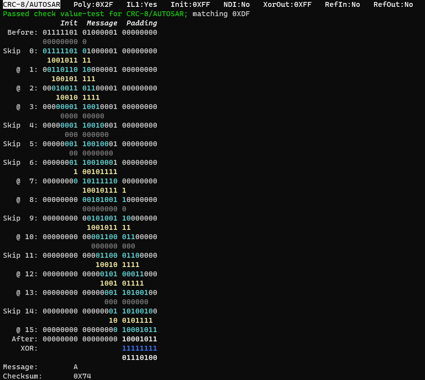

# CRC Explorer
> *sail the seven seas of CRCs*  

## Tour

Try these commands to get an overview.

* `make`
* `crc zoo`
* `crc enc -m A -c 29 -steps -noskip`
* `scripts/test_perf.sh`
* `crc help`

## Raison d'être

This project was inspired by a school assignment where students were to implement a somewhat obscure CRC specification. It's obscurity was meant to hinder the reuse of example implementations on the Internet, but also meant the only direct means of checking one's work was some provided example pairs of input strings and their associated CRC values. Only problem - the example values were faulty, being sourced from the educator's own incorrect implementation. 

A frustrating experience to be sure, but an excellent lesson in the importance of testing for correctness and validity of outputs.  

## Features

### Validatable (it's a word)

The simple algorithm and available outputs makes the process easy to validate manually, and provides confidence for validating other implementations in turn.

### Educational output

The process can be viewed step-by-step (with some options to lessen verbosity), giving a visual respresentation of how different generator polynomials and inital values affect the result. Sample output:

 

Understanding how the long hand-method works is very helpful for understanding other methods, including the famous "SIMPLE" algorithm.

### Zoo

A library of CRC specifications is included for testing and as reference; sources are at the end of this document. 
Edit `zoo.h` if the one you need is not listed.
Viewing the Zoo simultaneously performs basic check value-testing of the selected engine for each specification - an easy first test after making a change.

### API for plug-in validation of other implementations

See details further down. 

### Validation and performance tests

Facilities for validation and performance tests are included. The actual tests are fairly basic (described below); to extend this functionality edit the functions 
`ImplValid` and `ImplPerf` respectively. 

The currently included validation test performs 3 steps:
1. Encode standard input, "123456789" - should match check value in library.
2. Error check standard input using library check value - should return 0.
3. Error check modified standard input - should return a non-zero result.

The currently included performance test measures clock cycles while encoding randomized 8-bit numbers in 64 kiB, 1 MiB and 16 MiB streams. Results in seconds and MiB/s.

## External engine API

To test your CRC implemenation, 
1. add it into the `engine.c` definition of `GetRem` and 
2. `#define CRC_EXPLORER_EXTERNAL` in `engine.h`.

`GetRem` returns a remainder value from a CRC definition and a message input, compare declaration below. 

When using this functionality, the command line option `-i` activates the internal engine for comparison.

`engine.h` declaration of `GetRem`:

~~~c
/**
*  @brief  Get remainder from CRC calculation
*  @return The remainder
*  @param  crc_t*   crc    A CRC definition
*  @param  msg_t*   msg    A message to process
*  @param  uint64_t check  0; return CRC value for msg 
*                          CRC value; return 0 for unchanged msg 
*
*  @note   Fields of crc and msg:
*
*          msg->
*            msgStr     Message as string 
*            len        Character-count excluding \0
*          
*          crc->
*            n          Bit width 
*            g          Generator polynomial
*            il1        Generator polynomial has Implicit leading 1. 
*                        Generally true, but provided because exceptions
*                        do exist (example: CRC-15/CAN).
*            init       Initial CRC value, also known as seed.
*            nondirect  Init can be "direct" or "non-direct".
*                        Generally false, but provided because exceptions
*                        do exist (example: CRC-16/CCITT).
*            inputLSF   Input reflected; message bytes are encoded LSF.
*            resultLSF  Result reflected; result is encoded LSF.
*                        Note, reflection is over whole value, not per byte. 
*            xor        Final XOR; XOR result with this value after calculation
*                        is done, but before result reflection (if any). 
*
*/
uint64_t GetRem(crc_t* crc, msg_t* msg, uint64_t check);
~~~

## Commands and options reference

 

## References

The links below were very helpful for this project.

https://crccalc.com/                                 
http://srecord.sourceforge.net/crc16-ccitt.html       
https://reveng.sourceforge.io/crc-catalogue/all.htm 

